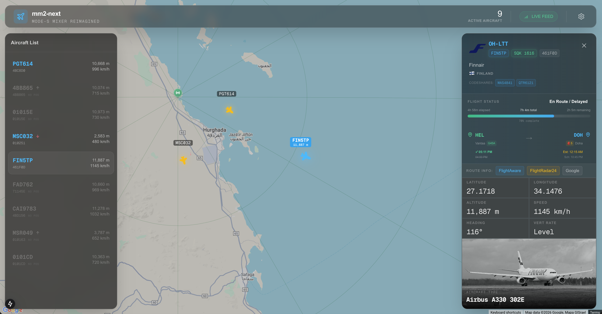

# ✈️ MM2-Next


A modern, beautiful web interface for ADS-B aircraft tracking - built to replace the outdated ModeSMixer2 interface.



## 🎯 Motivation

ModeSMixer2 has been the go-to solution for ADS-B tracking for years, but let's be honest - **it's ugly and outdated**. MM2-Next is a complete reimagination of aircraft tracking interfaces, built with modern web technologies to provide:

- 🎨 **Beautiful, modern UI** with dark mode and glassmorphism effects
- 📊 **Rich flight data** from FlightAware API (routes, times, gates, terminals)
- 🗺️ **Interactive Google Maps** with aircraft markers and trajectories
- ✈️ **Detailed aircraft info** from ADS-B DB (photos, registration, airline)
- 🌍 **100+ countries** with ICAO address lookup and flag emojis
- 📈 **Real-time updates** via WebSocket connection
- 🎯 **Flight progress tracking** with visual progress bars
- 🏢 **Airline logos** for professional appearance

## ✨ Features

### Real-Time Tracking

- Live aircraft positions from dump1090 JSON API
- WebSocket updates every second
- Aircraft trails showing flight paths
- Home station marker on map

### Flight Information

- **Route Details**: Origin → Destination with IATA codes
- **Times**: Scheduled, Estimated, and Actual departure/arrival
- **Gates & Terminals**: Complete airport facility information
- **Baggage Claim**: Arrival baggage carousel numbers
- **Flight Progress**: Visual progress bar with elapsed/remaining time
- **Codeshares**: Display of codeshare flight numbers

### Aircraft Details

- **Photos**: High-quality aircraft images from ADS-B DB
- **Registration**: Aircraft tail number
- **Type**: Aircraft model and manufacturer
- **Airline**: Operating airline with logo
- **Country**: Registration country with flag emoji
- **Vertical Speed**: Climb/descent indicators with arrows

### User Experience

- **Unit Settings**: Switch between Metric and Imperial units
- **Compact Layout**: Optimized for information density
- **Responsive Design**: Works on desktop and mobile
- **Dark Theme**: Easy on the eyes for night operations

## 🚀 Quick Start

### Prerequisites

1. **dump1090 or compatible decoder** running and accessible on your network

   - Must have JSON API enabled (port 8080)
   - Supported decoders:
     - **dump1090-fa** (FlightAware)
     - **dump1090-mutability**
     - **readsb**
     - **fr24feed** (FlightRadar24's dump1090)
   - If you're already feeding FlightRadar24, you're all set!

2. **Google Maps API Key**

   - Get one from [Google Cloud Console](https://console.cloud.google.com/)
   - Enable Maps JavaScript API

3. **FlightAware AeroAPI Key** (optional but recommended)
   - Sign up at [FlightAware AeroAPI](https://www.flightaware.com/commercial/aeroapi/)
   - Free tier available for personal use

### Installation

1. **Clone the repository**

   ```bash
   git clone https://github.com/yourusername/mm2-next.git
   cd mm2-next
   ```

2. **Install dependencies**

   ```bash
   npm install
   ```

3. **Configure environment variables**

   ```bash
   cp .env.sample .env
   ```

   Edit `.env` with your settings:

   ```env
   GOOGLE_MAPS_API_KEY=your_google_maps_api_key
   LOCATION=27.2579:33.8116      # Your receiver location (lat:lon)
   DUMP1090_HOST=192.168.3.7                  # Your dump1090 host
   DUMP1090_JSON_PORT=8080                    # dump1090 JSON API port
   FLIGHTAWARE_API_KEY=your_flightaware_key   # Optional, but recommended
   ```

4. **Run the development server**

   ```bash
   npm run dev
   ```

5. **Open your browser**
   ```
   http://localhost:8082
   ```

### Docker Deployment (Recommended)

The easiest way to run MM2-Next is using Docker:

1. **Edit environment file**

   ```bash
   # Edit .env.docker with your settings
   nano .env.docker
   ```

   Required settings:

   ```env
   GOOGLE_MAPS_API_KEY=your_google_maps_api_key
   LOCATION=27.2579:33.8116
   DUMP1090_HOST=192.168.3.7
   DUMP1090_JSON_PORT=8080
   FLIGHTAWARE_API_KEY=your_flightaware_key  # Optional
   ```

2. **Run with Docker Compose**

   ```bash
   docker-compose up -d
   ```

3. **Access the application**

   ```
   http://localhost:8082
   ```

4. **View logs**

   ```bash
   docker-compose logs -f
   ```

5. **Stop the application**
   ```bash
   docker-compose down
   ```

**Using pre-built image from Docker Hub:**

```bash
docker pull docker.io/ysukharenko/mm2-next:latest
```

The Docker image supports multiple platforms:

- `linux/amd64` - x86_64 (Regular PCs, Intel/AMD)
- `linux/arm64` - ARM64 (Raspberry Pi 4/5, Apple Silicon)
- `linux/arm/v7` - ARMv7 (Raspberry Pi 3) - **Supported** via Next.js 15

**Note:** This project uses Next.js 15 instead of Next.js 16 to maintain compatibility with ARM v7 (Raspberry Pi 3). Next.js 16's Turbopack requires WASM bindings not available on ARMv7.

Docker will automatically pull the correct image for your platform.

**Automated Builds:**

Docker images are automatically built and published via GitHub Actions on every release:

- Push to `main` branch → builds `latest` tag
- Create release tag (e.g., `v1.0.0`) → builds versioned tags (`1.0.0`, `1.0`, `1`, `latest`)

**Manual build (for development):**

```bash
# Local build for testing
docker build -t mm2-next .

# Multi-platform build (requires buildx)
./build-docker.sh v1.0.0
```

### Production Build

```bash
npm run build
npm start
```

## 🛠️ Technology Stack

- **Framework**: Next.js 15 (App Router)
- **Language**: TypeScript
- **Styling**: Tailwind CSS
- **Maps**: Google Maps JavaScript API (@vis.gl/react-google-maps)
- **Icons**: Lucide React
- **Real-time**: Socket.IO
- **HTTP Client**: node-fetch
- **Caching**: node-cache

## 📡 Data Sources

1. **dump1090** - Real-time ADS-B aircraft positions

   - Position (lat/lon)
   - Altitude, Speed, Heading
   - Vertical Rate
   - Squawk code
   - Flight trails

2. **FlightAware AeroAPI v4** - Flight route information

   - Origin/Destination airports
   - Scheduled/Estimated/Actual times
   - Gates, Terminals, Baggage claim
   - Flight status
   - Codeshare information
   - Operating airline

3. **ADS-B DB** - Aircraft database

   - Aircraft photos
   - Registration details
   - Aircraft type
   - Manufacturer
   - Airline information

4. **ICAO Address Lookup** - Country identification

   - 100+ countries supported
   - Flag emojis
   - ISO country codes

5. **Airline Logos** - Visual branding
   - 1400+ airline logos
   - Cached locally for performance

## 🎨 Screenshots

### Main Interface

- Interactive map with aircraft markers
- Real-time position updates
- Aircraft trails

### Detail Panel

- Aircraft photo and information
- Flight route with progress bar
- Departure/Arrival times and gates
- Airline logo and country flag

### Settings

- Unit system toggle (Metric/Imperial)
- Persistent preferences

## 🤝 Contributing

Contributions are welcome! Please feel free to submit a Pull Request.

## 📝 License

MIT License - feel free to use this project for personal or commercial purposes.

## 🙏 Acknowledgments

- **dump1090** community for the excellent ADS-B decoder
- **FlightAware** for their comprehensive flight data API
- **ADS-B DB** for aircraft database
- **Jxck-S** for the airline logos repository
- All ADS-B enthusiasts who made this hobby possible

## 📧 Support

If you encounter any issues or have questions, please open an issue on GitHub.

---

**Built with ❤️ for the ADS-B community**
